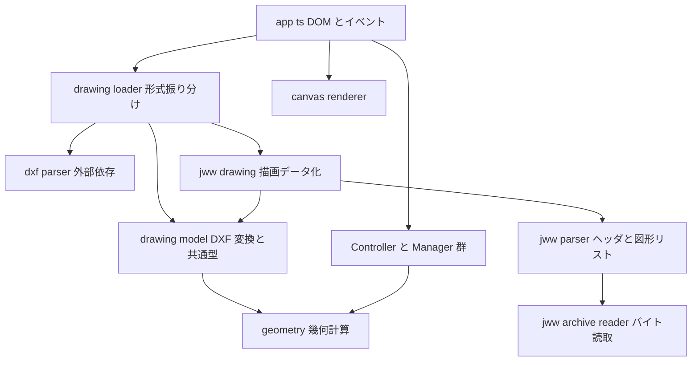
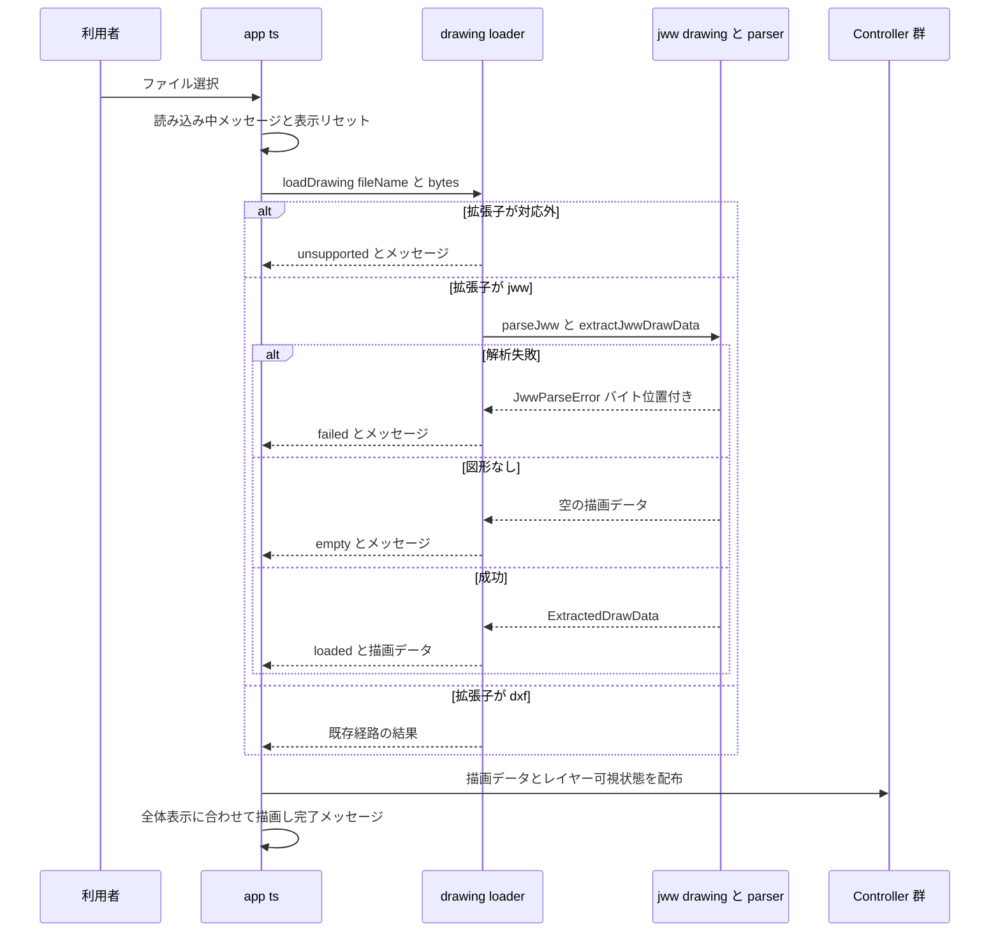

# Technical Design: jww-file-loading

## Overview

**Purpose**: 手持ち図面が JWW 中心の利用者に対し、DXF へ変換することなくブラウザ上で図面を開く手段を提供する。

**Users**: 既存の DXF Viewer 利用者。ツールバーのファイル選択から `.jww` を選ぶだけで、DXF と同じ閲覧・計測操作が使える。

**Impact**: 現在 `app.ts` が `dxf-parser` を直接呼んでいる読み込み経路を、拡張子で分岐する薄いローダ関数に置き換える。JWW の解析と描画データ化は新規の純粋関数モジュール群が担い、既存の Controller / Manager / Renderer は形式を知らないまま動作し続ける。共通契約 `ExtractedDrawData` はレイヤーの初期可視状態を持てるよう一般化する。

### Goals

- `.jww` ファイルを既存のファイル選択から読み込み、線・真円・円弧を描画する（要件 1, 2）
- JWW のレイヤグループ／レイヤを一意な識別子に写像し、ファイル内の表示状態を初期値としてレイヤー表示切替を機能させる（要件 3）
- 読み込み後、ビュー操作・距離測定・交点スナップ・エッジ選択が DXF と同一の操作・書式で動作する（要件 4）
- 解析失敗を無音の誤描画ではなく、バイト位置を伴う明示的な失敗として扱い、利用者には形式別のメッセージを出す（要件 5）
- 実行時依存を増やさず、ビルド構成（設定ファイルなし）を変えない

### Non-Goals

- 文字・寸法・ソリッド・点・ブロック参照の描画（バイト消費のみ行う）
- ブロック定義リスト（`m_DataListList`）の解析、およびブロック展開
- 楕円・楕円弧（扁平率が 1 でない円弧）の描画
- レイヤグループの縮尺を反映した実寸換算、線色・線種・線幅の再現
- JWW の書き出し・編集、DXF ⇔ JWW 変換

## Boundary Commitments

### This Spec Owns

- JWW バイト列の解釈（シグネチャ判定、ヘッダ、図形データリスト）と、その結果型 `JwwDocument`
- `JwwDocument` から既存の描画契約 `ExtractedDrawData` への変換（対象図形の選別、レイヤー識別子の生成、初期可視状態、境界計算）
- ファイル名の拡張子による形式振り分けと、読み込み結果（成功／対応形式外／対応要素なし／解析失敗）の分類とユーザー向け文言
- 共通契約 `ExtractedDrawData.layers` の型（`DrawingLayer[]`）と、その可視状態を `LayerController` の初期状態へ渡す経路

### Out of Boundary

- 既存 DXF 経路の解析ロジック（`dxf-parser` 呼び出しと `extractDrawData()` のエンティティ変換規則）— 呼び出し位置の移動と `layers` の型変更以外は変更しない
- 距離測定・交点計算・エッジ選択・ビュー操作の判定ロジック（`measurement-manager` / `selection-controller` / `edge-selection-manager` / `viewport-controller` / `geometry`）— 本スペックは入力データを供給するのみ
- 描画処理（`canvas-renderer`）— 新しい `DrawCommand` 種別を追加しないため変更しない
- DOM 構造とスタイル（`index.html` の `accept` 属性を除く）

### Allowed Dependencies

- 既存の純粋関数モジュール（`geometry.ts` / `drawing-model.ts`）と既存依存 `dxf-parser`
- ブラウザ標準 API のうち `DataView` / `TextDecoder`（`utf-8`, `shift_jis`）
- 新規の実行時依存は追加しない。ビルド設定ファイル（`vite.config.ts` / `vitest.config.ts`）も追加しない
- 依存方向は `app.ts` → `drawing-loader` → `jww-drawing` → `jww-parser` → `jww-archive-reader` および `drawing-model` → `geometry` の一方向。逆向きの import を作らない

### Revalidation Triggers

- `ExtractedDrawData` の形（特に `layers`）の変更 — `LayerController` と全フォーマットアダプタに波及する
- `LoadDrawingResult` の分岐追加・文言変更 — `app.ts` の表示分岐に波及する
- `DrawCommand` 種別の追加（例: 将来の楕円対応）— `canvas-renderer` と当たり判定の前提に波及する
- レイヤー識別子の組み立て規則の変更 — レイヤー表示切替とエッジ選択表示の両方に波及する
- 解析範囲を図形データリストより後ろへ広げる判断 — `CTime` 等の未確定要素を抱え込む

## Architecture

### Existing Architecture Analysis

現状は `app.ts` の `onFileChange` が「ファイル読み取り → `DxfParser` → `extractDrawData()` → 各 Controller へ配布 → 描画」を直接行っている。`extractDrawData()` は DXF エンティティを描画用の `DrawCommand[]` と当たり判定用の `Segment[]` に二分し、レイヤー名文字列を境界で正規化する。この「描画表現と線分表現の二重化」と「レイヤー名は文字列キー」という 2 点が、本機能が守るべき既存の設計判断である。

一方 `testing.md` は「`app.ts` に判断ロジックを書くのは設計の誤り」と定める。形式判定・エラー分類・ユーザー向け文言は判断ロジックであるため、`app.ts` には置かない。

### Architecture Pattern & Boundary Map



**Architecture Integration**:

- 選択パターン: **フォーマット別アダプタ**。`ExtractedDrawData` を唯一の共通契約とし、DXF と JWW は対等なアダプタとして並ぶ
- 責務分離: バイト読取（`jww-archive-reader`）／形式解釈（`jww-parser`）／描画データ化（`jww-drawing`）／振り分けと文言（`drawing-loader`）を分ける。各層は下位層の型だけに依存する
- 既存パターンの維持: 1 ファイル 1 責務のフラット構成、純粋関数モジュールは DOM を参照しない、ユーザー向けメッセージはロジック層が返す、レイヤー同一性は文字列キー
- 新規コンポーネントの根拠: 未知バイナリの解析は「バイト位置を持つ読み取りカーソル」という状態を必要とするため、純粋関数だけでは表現が冗長になる。カーソルのみをクラス化し、その上の層は純粋関数に保つ
- ステアリング逸脱（要記録）: `structure.md` のクラス命名規約は `〜Controller` / `〜Manager` / `〜Renderer` のみを定義している。本設計は `JwwArchiveReader` という新しい役割（読み取りカーソル）を導入する。実装完了後に `structure.md` へ追記する

### Technology Stack

| Layer | Choice / Version | Role in Feature | Notes |
|-------|------------------|-----------------|-------|
| Frontend | TypeScript（既存 ES2020 / Bundler 解決） | JWW 解析・描画データ化・振り分けの全実装 | 新規実行時依存なし |
| Frontend | `DataView` / `TextDecoder`（ブラウザ標準） | バイナリ読取と CP932（`shift_jis`）文字列デコード | Node も full-icu 既定ビルドで `shift_jis` を解決でき、Vitest 上で検証可能 |
| Frontend | `dxf-parser` ^1.1.2（既存） | DXF 経路のみで使用 | 変更なし |
| Build / Test | Vite ^8 / Vitest ^5（既存） | 設定ファイルを追加せず現状のまま | wasm 等の追加ローダを要する選択肢は不採用（`research.md` 参照） |

採用見送りの外部ライブラリ（`ezjww`: 公開ビルドが Node 専用、`jww-parser`: AGPL-3.0）の調査詳細は `research.md` に記載する。結論として、ブラウザで使える JWW パーサライブラリは存在せず、自前実装を選択する。

## File Structure Plan

### Directory Structure

```
.
├── jww-archive-reader.ts     # MFC CArchive のバイト読取カーソル（プリミティブ・CString・カウント・オブジェクトタグ）
├── jww-parser.ts             # JWW ヘッダ + 図形データリストの解釈、JwwDocument 型、JwwParseError
├── jww-drawing.ts            # JwwDocument -> ExtractedDrawData 変換、レイヤー識別子の組み立て
├── drawing-loader.ts         # 拡張子による形式振り分け、LoadDrawingResult とユーザー向け文言
├── jww-parser.test.ts        # バイト読取と形式解釈（合成バイト列で検証）
└── drawing-loader.test.ts    # 形式振り分け・描画データ化・エラー分類
```

### Modified Files

- `drawing-model.ts` — `DrawingLayer` 型を追加し、`ExtractedDrawData.layers` を `DrawingLayer[]` へ変更。`extractDrawData()` は DXF のレイヤーを `visible: true` で返す
- `layer-controller.ts` — `setLayers(layers: DrawingLayer[])` に変更し、`visible: false` のレイヤーを初期非表示として保持する
- `app.ts` — `onFileChange` を「`file.arrayBuffer()` → `loadDrawing()` → 結果分岐」に置き換える。成功時の配布処理と成功メッセージ組み立ては現行どおり
- `index.html` — ファイル入力の `accept` を `.dxf,.jww` に変更
- `drawing-model.test.ts` / `managers.test.ts` — `layers` の形変更に追随
- `README.md` — 対応形式と JWW の制限（描画対象・スコープ外要素）を追記

## System Flows



**Key Decisions**:

- 失敗時の表示リセット（キャンバス消去・操作無効化）は解析開始前に一度行い、失敗分岐では復旧しない（要件 5.5）
- 「対応要素なし」は失敗ではなく正常終了の一種として区別する（要件 2.5）

## Requirements Traceability

| Requirement | Summary | Components | Interfaces | Flows |
|-------------|---------|------------|------------|-------|
| 1.1 | `.dxf` / `.jww` を選択候補に出す | index.html | `accept=".dxf,.jww"` | — |
| 1.2 | `.jww` を JWW として解析・描画 | drawing-loader, jww-parser, jww-drawing | `loadDrawing` | 読み込みフロー |
| 1.3 | `.dxf` は従来どおり | drawing-loader, drawing-model | `loadDrawing`, `extractDrawData` | 読み込みフロー |
| 1.4 | 拡張子判定は大小文字非依存 | drawing-loader | `loadDrawing` | — |
| 1.5 | 対応外拡張子は解析せず通知 | drawing-loader | `LoadDrawingResult.unsupported` | 読み込みフロー |
| 2.1 | 線を線分として描画 | jww-parser, jww-drawing | `JwwLineEntity`, `extractJwwDrawData` | — |
| 2.2 | 真円・円弧を描画 | jww-parser, jww-drawing | `JwwArcEntity`, `extractJwwDrawData` | — |
| 2.3 | 扁平な円弧は除外して継続 | jww-drawing | `extractJwwDrawData` | — |
| 2.4 | 対象外クラスは除外して継続 | jww-parser | エンティティ消費テーブル | — |
| 2.5 | 図形ゼロ時のメッセージ | drawing-loader | `LoadDrawingResult.empty` | 読み込みフロー |
| 2.6 | 全体が収まる初期表示 | app.ts（既存 `fitToScreen`） | `ExtractedDrawData.bounds` | 読み込みフロー |
| 2.7 | 縮尺換算をしない | jww-drawing | `extractJwwDrawData` | — |
| 3.1 | 図形のあるアドレスのみ一覧化 | jww-drawing | `extractJwwDrawData`, `formatJwwLayerName` | — |
| 3.2 | 名前未設定時は番号ベースの既定名 | jww-drawing | `formatJwwLayerName` | — |
| 3.3 | ファイルの非表示状態を初期値に | jww-parser, jww-drawing, layer-controller | `JwwLayer.state`, `DrawingLayer.visible`, `setLayers` | — |
| 3.4 | 非表示レイヤーは描画・測定・選択の対象外 | layer-controller（既存フィルタ） | `filterVisibleCommands`, `filterVisibleSegments` | — |
| 3.5 | 表示に切替で対象に復帰 | app.ts / layer-controller（既存） | `setVisible` | — |
| 3.6 | 日本語レイヤー名を文字化けなく表示 | jww-archive-reader | `readString`（CP932） | — |
| 3.7 | 全レイヤー非表示でも一覧は出す | jww-drawing, layer-controller | `DrawingLayer[]` | — |
| 4.1 | ビュー操作は DXF と同一 | app.ts / viewport-controller（既存） | `ExtractedDrawData.bounds` | — |
| 4.2 | 距離と ΔX / ΔY を同一書式で表示 | measurement-manager（既存） | `Segment[]` 供給 | — |
| 4.3 | 交点も頂点として選択可能 | drawing-model（既存 `computeSelectableVertices`） | `Segment[]` 供給 | — |
| 4.4 | エッジ選択でレイヤー名表示 | jww-drawing, edge-selection-manager（既存） | `Segment.layer` | — |
| 4.5 | 円・円弧は測定・選択の対象外 | jww-drawing | `Segment` を生成しない | — |
| 4.6 | 新規読み込みで前回状態を破棄 | app.ts（既存 `resetLoadedDataState`） | — | 読み込みフロー |
| 5.1 | 読み込み中メッセージ | app.ts（既存） | — | 読み込みフロー |
| 5.2 | 完了メッセージ（要素数・レイヤー数） | app.ts（既存） | `ExtractedDrawData` | 読み込みフロー |
| 5.3 | JWW 解析失敗のメッセージ | jww-parser, drawing-loader | `JwwParseError`, `LoadDrawingResult.failed` | 読み込みフロー |
| 5.4 | 拡張子と内容の不一致も失敗扱い | jww-parser, drawing-loader | `isJwwSignature` | 読み込みフロー |
| 5.5 | 失敗時は表示を空にし操作を無効化 | app.ts | `setZoomControlsEnabled`, `clearCanvas` | 読み込みフロー |
| 5.6 | 外部送信しない | 全体（クライアント完結） | — | — |

## Components and Interfaces

| Component | Domain/Layer | Intent | Req Coverage | Key Dependencies (P0/P1) | Contracts |
|-----------|--------------|--------|--------------|--------------------------|-----------|
| JwwArchiveReader | バイト読取 | MFC `CArchive` の読み取りカーソル | 3.6, 5.3 | なし | Service, State |
| jww-parser | 形式解釈 | ヘッダと図形データリストを `JwwDocument` へ | 1.2, 2.1, 2.2, 2.4, 3.3, 5.3, 5.4 | JwwArchiveReader (P0) | Service |
| jww-drawing | 描画データ化 | `JwwDocument` を `ExtractedDrawData` へ | 2.1–2.3, 2.7, 3.1–3.3, 3.7, 4.4, 4.5 | jww-parser (P0), drawing-model (P0), geometry (P1) | Service |
| drawing-loader | オーケストレーション | 形式振り分けと結果分類・文言 | 1.2–1.5, 2.5, 5.3, 5.4 | jww-drawing (P0), drawing-model (P0), dxf-parser (External P0) | Service |
| drawing-model（変更） | 共通契約 | `DrawingLayer` と `ExtractedDrawData` の一般化 | 1.3, 3.3 | geometry (P0) | Service |
| layer-controller（変更） | 状態管理 | 初期可視状態の受け入れ | 3.3, 3.4, 3.5, 3.7 | drawing-model (P0) | State |
| app.ts（変更） | DOM 結線 | ファイル取得と結果の DOM 反映 | 1.1, 2.6, 4.6, 5.1, 5.2, 5.5 | drawing-loader (P0) | — |

### バイト読取層

#### JwwArchiveReader

| Field | Detail |
|-------|--------|
| Intent | バイト位置を保持し、MFC `CArchive` の書式で値を読み出す |
| Requirements | 3.6, 5.3 |

**Responsibilities & Constraints**

- リトルエンディアンの `BYTE` / `WORD` / `DWORD` / `double`、MFC `CString`（長さ前置き + CP932）、MFC のカウント（`WORD`、`0xFFFF` エスケープで `DWORD`）、オブジェクトタグを読む
- 読み取り位置が範囲外になる場合は必ず `JwwParseError`（バイト位置付き）を投げる。無音で `NaN` や空文字を返さない
- 文字列デコードは `TextDecoder("shift_jis")` を用いる。DOM を参照しない

**Dependencies**

- Inbound: jww-parser — 読み取り要求（P0）
- External: `DataView`, `TextDecoder`（P0）

**Contracts**: Service [x] / API [ ] / Event [ ] / Batch [ ] / State [x]

##### Service Interface

```typescript
export type JwwObjectTag =
  | { kind: "null" }
  | { kind: "new-class"; schema: number; className: string }
  | { kind: "class-ref"; classIndex: number };

export class JwwArchiveReader {
  constructor(buffer: ArrayBuffer);
  get offset(): number;
  get byteLength(): number;
  readAscii(length: number): string;
  readByte(): number;
  readWord(): number;
  readDword(): number;
  readDouble(): number;
  readString(): string;
  readCount(): number;
  readObjectTag(): JwwObjectTag;
  skip(byteLength: number): void;
}
```

- Preconditions: `buffer` は読み込んだファイル全体
- Postconditions: 各 `read*` は読み取ったバイト数だけ `offset` を進める
- Invariants: `0 <= offset <= byteLength`。範囲を超える要求は例外となり `offset` は変化しない

##### State Management

- 状態はカーソル位置 `offset` のみ。巻き戻し・先読みは提供しない（一方向走査で十分なため）

### 形式解釈層

#### jww-parser

| Field | Detail |
|-------|--------|
| Intent | JWW バイト列を、描画に必要な情報だけを持つ `JwwDocument` へ解釈する |
| Requirements | 1.2, 2.1, 2.2, 2.4, 3.3, 5.3, 5.4 |

**Responsibilities & Constraints**

- シグネチャ `"JwwData."` とバージョン `DWORD` を検証し、ヘッダをバージョン分岐込みで走査する
- ヘッダから、レイヤグループ／レイヤの状態・名前・縮尺を保持する（縮尺は保持するのみで換算には使わない）
- 図形データリスト（`m_DataList`）を、要素数 → オブジェクトタグ → クラス別フィールドの順で走査する。クラス名は初出時に記録し、以降のタグ参照で引く
- 7 つの図形クラス（`CDataSen` / `CDataEnko` / `CDataTen` / `CDataMoji` / `CDataSunpou` / `CDataSolid` / `CDataBlock`）すべてのフィールドを正確に消費する。`CDataSen` と `CDataEnko` のみを結果に含め、残りは消費のみ行い `skippedCount` に数える
- ブロック定義リスト（`m_DataListList`）以降は読まない
- 未知のクラス名、範囲外参照、要素数の異常はすべて `JwwParseError` とする（部分的な結果を返さない）

**Dependencies**

- Inbound: jww-drawing（P0）
- Outbound: JwwArchiveReader（P0）

**Contracts**: Service [x] / API [ ] / Event [ ] / Batch [ ] / State [ ]

##### Service Interface

```typescript
import type { Point } from "./geometry";

export type JwwLayerAddress = { group: number; layer: number };

export type JwwLayerState = 0 | 1 | 2 | 3;

export type JwwLayer = { state: JwwLayerState; name: string };

export type JwwLayerGroup = {
  state: JwwLayerState;
  scale: number;
  name: string;
  layers: JwwLayer[];
};

export type JwwHeader = {
  version: number;
  memo: string;
  groups: JwwLayerGroup[];
};

export type JwwLineEntity = {
  type: "line";
  address: JwwLayerAddress;
  from: Point;
  to: Point;
};

export type JwwArcEntity = {
  type: "arc";
  address: JwwLayerAddress;
  center: Point;
  radius: number;
  startAngle: number;
  sweepAngle: number;
  tiltAngle: number;
  flatness: number;
  fullCircle: boolean;
};

export type JwwEntity = JwwLineEntity | JwwArcEntity;

export type JwwDocument = {
  header: JwwHeader;
  entities: JwwEntity[];
  skippedCount: number;
};

export class JwwParseError extends Error {
  readonly offset: number;
  constructor(message: string, offset: number);
}

export function isJwwSignature(buffer: ArrayBuffer): boolean;
export function parseJww(buffer: ArrayBuffer): JwwDocument;
```

- Preconditions: `parseJww` は `isJwwSignature` を内部でも検証する（呼び出し側の事前判定に依存しない）
- Postconditions: 戻り値の `entities` は線と円弧のみ。`header.groups` は必ず 16 要素、各 `layers` は 16 要素
- Invariants: 角度はラジアン、座標はファイル内の値そのまま（換算なし）

**Implementation Notes**

- Integration: ヘッダ項目の順序とバージョン分岐は `research.md` の一次情報（`jwdatafmt.txt`）に従う。分岐点は Ver.3.00 / 3.51 / 4.20 の 3 か所が主
- Validation: 図形データリスト先頭の要素数と最初のクラスタグを検証し、既知クラス名でなければ即座に失敗する。ヘッダ誤読を早期に検出するための主要な防波堤
- Risks: ヘッダ走査の 1 項目のずれが全体を壊す。合成バイト列によるユニットテストと、実ファイルでの目視確認の両方を完了条件とする

### 描画データ化層

#### jww-drawing

| Field | Detail |
|-------|--------|
| Intent | `JwwDocument` を既存の描画契約へ変換する |
| Requirements | 2.1, 2.2, 2.3, 2.7, 3.1, 3.2, 3.3, 3.7, 4.4, 4.5 |

**Responsibilities & Constraints**

- 線 → `DrawCommand("line")` と `Segment` の両方を生成する（測定・選択の対象になる）
- 円弧 → 全円フラグが立つ場合は `DrawCommand("circle")`、それ以外は `DrawCommand("arc")`（`start = 開始角`, `end = 開始角 + 円弧角`）。`Segment` は生成しない（要件 4.5）
- 扁平率が 1 から `1e-9` を超えて離れる円弧は変換対象から除外する（要件 2.3）。傾き角は真円では描画に影響しないため無視する
- レイヤー識別子を `formatJwwLayerName()` で組み立て、`DrawCommand.layer` / `Segment.layer` / `DrawingLayer.name` に同一文字列を使う
- 変換対象の図形が存在するアドレスのみをレイヤー一覧に含める（要件 3.1）。可視判定はレイヤ状態が `0`（非表示）なら `visible: false`、それ以外は `true`
- 境界（`bounds`）は可視・非可視を問わず変換対象の全図形から求める。円・円弧は中心 ± 半径で含める（既存 DXF 実装と同じ規則）

**Dependencies**

- Inbound: drawing-loader（P0）
- Outbound: jww-parser（P0）, drawing-model（P0）, geometry（P1）

**Contracts**: Service [x] / API [ ] / Event [ ] / Batch [ ] / State [ ]

##### Service Interface

```typescript
import type { ExtractedDrawData } from "./drawing-model";
import type { JwwDocument, JwwHeader, JwwLayerAddress } from "./jww-parser";

export function formatJwwLayerName(header: JwwHeader, address: JwwLayerAddress): string;
export function extractJwwDrawData(document: JwwDocument): ExtractedDrawData;
```

- レイヤー識別子の規則: `"<グループ番号16進1桁>-<レイヤ番号16進1桁>"` を常に先頭に置き、グループ名・レイヤ名のいずれかが空でなければ ` (<グループ名>/<レイヤ名>)` を付す。空の側は省略し、両方空なら括弧ごと付けない
  - 例: 両方空 → `3-A` / 両方あり → `3-A (平面図/寸法)` / レイヤ名のみ → `0-5 (寸法)`
- Postconditions: 同じアドレスからは常に同じ識別子が得られ、異なるアドレスは常に異なる識別子になる
- Invariants: 座標値は `JwwDocument` の値をそのまま渡す（要件 2.7）

### オーケストレーション層

#### drawing-loader

| Field | Detail |
|-------|--------|
| Intent | ファイル名とバイト列から、描画データまたは分類済みエラーを返す |
| Requirements | 1.2, 1.3, 1.4, 1.5, 2.5, 5.3, 5.4 |

**Responsibilities & Constraints**

- 拡張子を小文字化して判定する。`.dxf` は `TextDecoder("utf-8")` でテキスト化して既存経路（`dxf-parser` → `extractDrawData`）、`.jww` は `parseJww` → `extractJwwDrawData`
- 解析例外を捕捉し、形式別の文言に変換する。例外を呼び出し側へ漏らさない
- 描画命令が 0 件の場合は `empty` を返す（形式によらず共通）
- DOM を参照しない。`File` ではなく構造型 `DrawingSource` を受け取る（テスト容易性のため）

**Dependencies**

- Inbound: app.ts（P0）
- Outbound: jww-drawing（P0）, drawing-model（P0）
- External: `dxf-parser`（P0）

**Contracts**: Service [x] / API [ ] / Event [ ] / Batch [ ] / State [ ]

##### Service Interface

```typescript
import type { ExtractedDrawData } from "./drawing-model";

export type DrawingFormat = "dxf" | "jww";

export type DrawingSource = { fileName: string; bytes: ArrayBuffer };

export type LoadDrawingResult =
  | { status: "loaded"; format: DrawingFormat; data: ExtractedDrawData }
  | { status: "empty"; message: string }
  | { status: "unsupported"; message: string }
  | { status: "failed"; message: string };

export function loadDrawing(source: DrawingSource): LoadDrawingResult;
```

- 文言（`structure.md` の「メッセージはロジック層が返す」に従う）
  - `unsupported`: `対応していないファイル形式です。DXFまたはJWWファイルを選択してください。`
  - `empty`: `対応エンティティが見つかりませんでした。`（既存文言を踏襲）
  - `failed`（DXF）: `DXFの解析に失敗しました。ファイル形式を確認してください。`（既存文言）
  - `failed`（JWW）: `JWWの解析に失敗しました。ファイル形式を確認してください。`

**Implementation Notes**

- Integration: `app.ts` は成功時のみ Controller へ配布し、完了メッセージ（ファイル名・要素数・レイヤー数）は現行の組み立てを維持する
- Validation: `.jww` でシグネチャが一致しない場合は `parseJww` が失敗し、`failed`（JWW）に落ちる（要件 5.4）
- Risks: DXF のテキスト化が `File.text()` から `TextDecoder("utf-8")` に変わる。どちらも UTF-8 デコードであり等価だが、既存 DXF ファイルでの回帰確認を完了条件に含める

### 共通契約の変更

#### drawing-model（変更）／layer-controller（変更）

```typescript
// drawing-model.ts
export type DrawingLayer = { name: string; visible: boolean };

export type ExtractedDrawData = {
  commands: DrawCommand[];
  segments: Segment[];
  layers: DrawingLayer[];
  bounds: Bounds | null;
};

// layer-controller.ts
setLayers(layers: DrawingLayer[]): void;
```

- `extractDrawData()`（DXF）は既存のレイヤー名収集結果を `{ name, visible: true }` に写して返す。並び順の規則（`localeCompare` 昇順）は変更しない
- `LayerController.setLayers()` は `visible` をそのまま初期状態として保持する。`getLayerNames()` / `isVisible()` / `setVisible()` / `filterVisible*()` のシグネチャと挙動は変更しない（要件 3.4, 3.5, 3.7 は既存実装のまま満たされる）

## Data Models

### Domain Model

- **JwwDocument**（本スペックが所有）: ヘッダ（レイヤグループ 16 × レイヤ 16 の状態・名前・縮尺）と、描画対象図形（線・円弧）の集合。JWW ファイル 1 件に対応する読み取り専用の値
- **ExtractedDrawData**（共通契約、本スペックが型を拡張）: 描画命令・線分・レイヤー（名前 + 初期可視状態）・境界。フォーマットに依存しない
- 不変条件:
  - レイヤー識別子はアドレス（グループ番号・レイヤ番号）から一意に決まる
  - `Segment` を持つのは線のみ。円・円弧は `DrawCommand` のみを持つ（既存 DXF の規則と同一）
  - 座標は常にファイル内の値（縮尺換算なし）

### Data Contracts & Integration

外部サービスとの通信は行わない。ファイル内容はブラウザ内で完結し、外部へ送信しない（要件 5.6）。

## Error Handling

### Error Strategy

解析層は**例外（`JwwParseError`）で失敗を表現**し、オーケストレーション層で**判別可能ユニオンへ変換**する。UI 層は分類済みの結果だけを扱う。部分的に壊れたデータを描画するより、明示的に失敗させることを優先する。

### Error Categories and Responses

- **利用者入力の誤り**: 対応外拡張子 → 解析せず `unsupported`（要件 1.5）
- **データの問題**: シグネチャ不一致・未知クラス名・範囲外読み取り・要素数異常 → `JwwParseError`（バイト位置を含む）→ `failed`（要件 5.3, 5.4）。開発者向けに `console.error` を残す（既存踏襲）
- **正常だが描画対象なし**: 対応図形 0 件 → `empty`（要件 2.5）
- 失敗時の UI 状態: キャンバスは空、拡大・縮小・全体表示は無効（要件 5.5）。解析前に一度リセットする現行実装で満たす

### Monitoring

サーバーを持たないため、失敗時の `console.error` 出力のみ。追加の監視は導入しない。

## Testing Strategy

`testing.md` の方針（モックを書かない・振る舞いを検証する・関心で束ねる・フィクスチャファイルを使わない）に従う。JWW のテストデータはテストファイル内の小さなバイト列ビルダで組み立て、期待値は literal で書く。

### Unit Tests（`jww-parser.test.ts`）

1. `JwwArchiveReader` が `WORD` / `DWORD` / `double` / MFC `CString`（CP932 の日本語を含む）を正しい順序と位置で読む（3.6）
2. `JwwArchiveReader` が範囲外読み取りでバイト位置付きの `JwwParseError` を投げる（5.3）
3. `parseJww` が線 1 本・円弧 1 つの最小ファイルから座標・半径・角度・レイヤアドレスを取り出す（2.1, 2.2）
4. `parseJww` が文字・点・ソリッドなど対象外クラスを正しく消費し、後続の線を取りこぼさない（2.4）
5. `parseJww` がシグネチャ不一致と未知クラス名で `JwwParseError` を投げる（5.4, 5.3）
6. `parseJww` がレイヤ状態 `0` と名前（日本語・空）をヘッダから取り出す（3.2, 3.3, 3.6）

### Integration Tests（`drawing-loader.test.ts`）

1. `loadDrawing` が `.JWW`（大文字）を JWW として扱い、`.txt` を `unsupported` にする（1.4, 1.5）
2. `loadDrawing` が JWW の線から `DrawCommand` と `Segment` を、円弧から `DrawCommand` のみを生成する（2.1, 2.2, 4.5）
3. 扁平率が 1 でない円弧が除外され、同じファイル内の線は描画対象として残る（2.3）
4. 非表示レイヤ（状態 `0`）が `visible: false` として返り、`LayerController.setLayers()` 経由で初期非表示になる（3.3, 3.7）
5. レイヤー識別子が名前あり・名前なし・同名異アドレスで一意かつ規則どおりに組み立てられる（3.1, 3.2, 4.4）
6. 対応図形 0 件で `empty`、解析失敗で JWW 用文言の `failed` が返る（2.5, 5.3）
7. DXF バイト列が従来どおり読み込め、レイヤーが `visible: true` で返る（1.3）

### 既存テストの更新

- `drawing-model.test.ts` / `managers.test.ts` — `layers` が `DrawingLayer[]` になったことへの追随（1.3, 3.3）

### 手動確認（完了条件）

1. 実 JWW ファイル（可能なら Ver.3.51 系と Ver.4.20 以降系の 2 つ）を開き、図形が欠落・崩れなく描画されること（2.1, 2.2）
2. 日本語レイヤー名が文字化けせず、JW_cad 側で非表示にしたレイヤーが初期非表示で現れること（3.3, 3.6）
3. 頂点・交点のスナップ測定とエッジ選択が DXF と同じ操作で機能すること（4.1–4.4）
4. 既存の DXF ファイルが従来どおり開けること（1.3）

## Performance & Scalability

- 解析は 1 パスの前方走査のみで、図形数に対して線形。追加のインデックスやキャッシュは持たない
- 既存の交点計算（`computeSelectableVertices`）が線分数に対して O(n²) である点は本機能でも変わらない。JWW は連続線を個別の線分として保持するため、同規模の図面では DXF より線分数が増えうる。今回は最適化を行わず、実ファイル確認時に体感速度を観察して必要性を判断する
